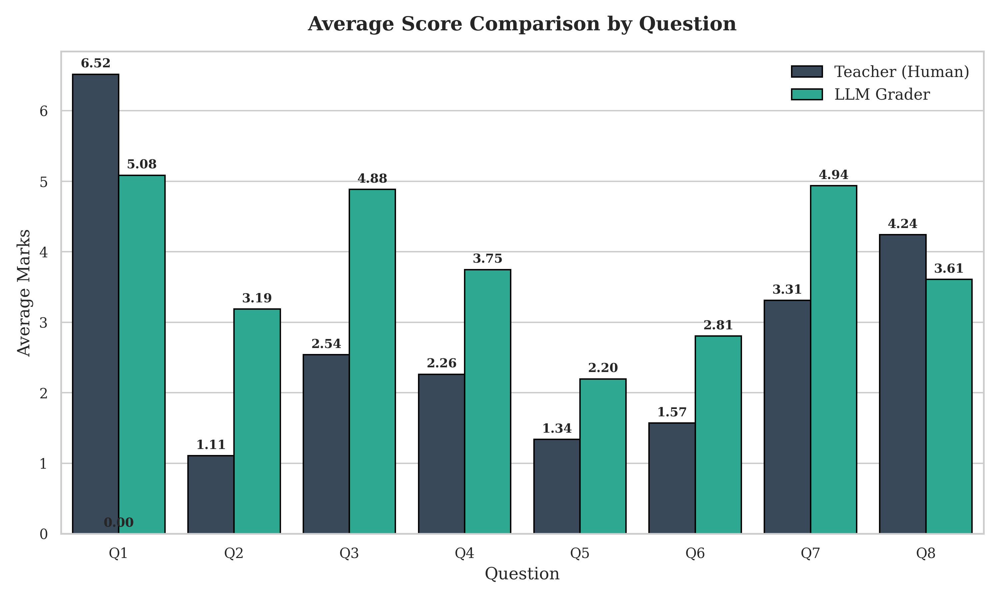
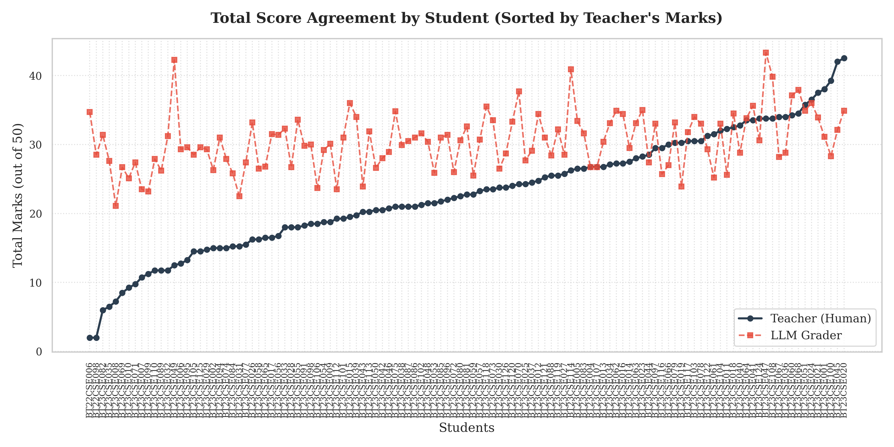
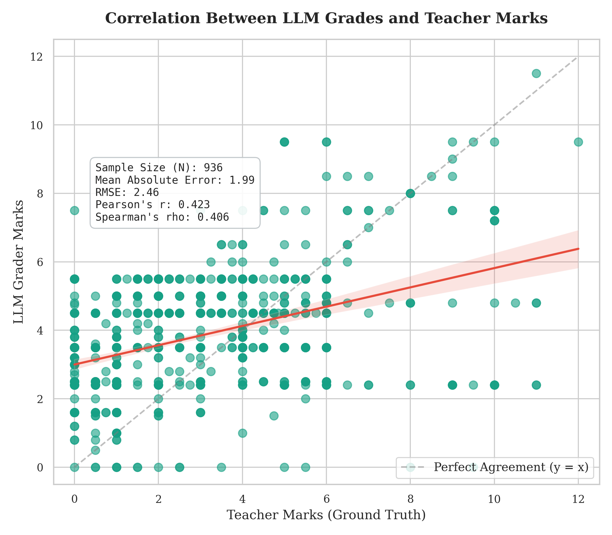
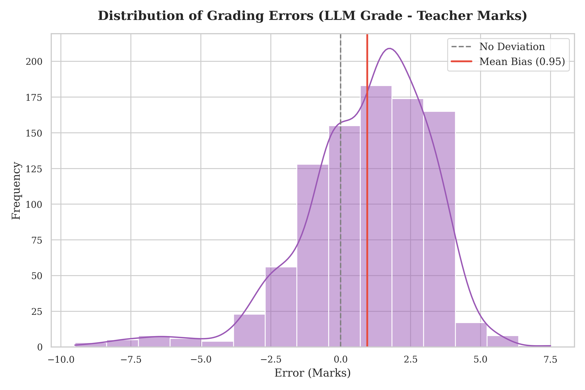
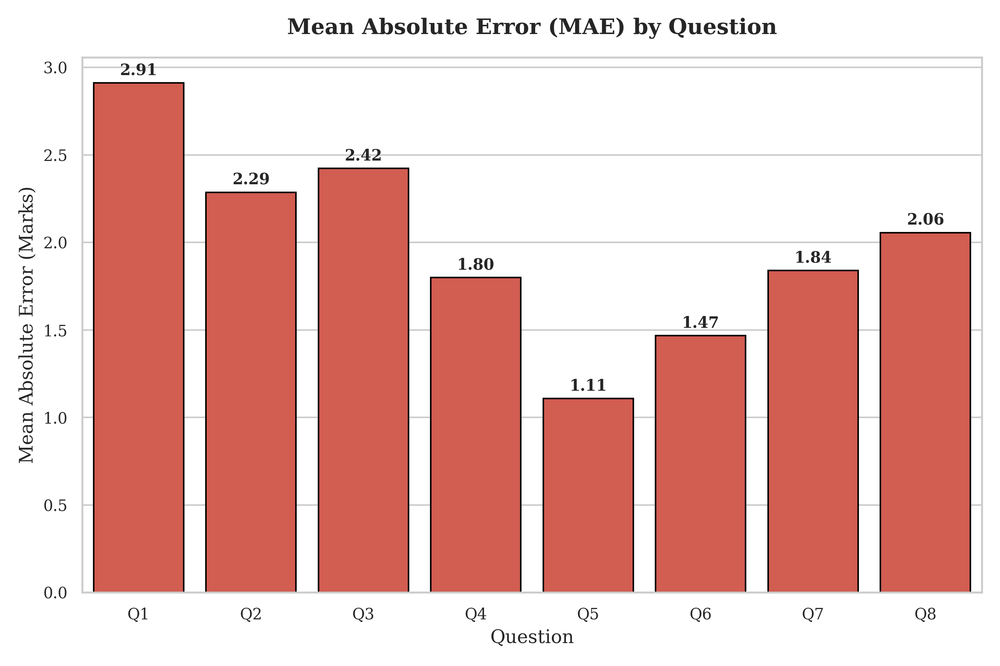
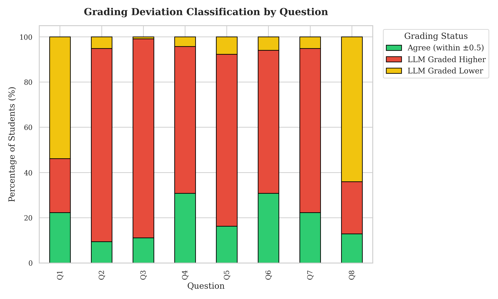
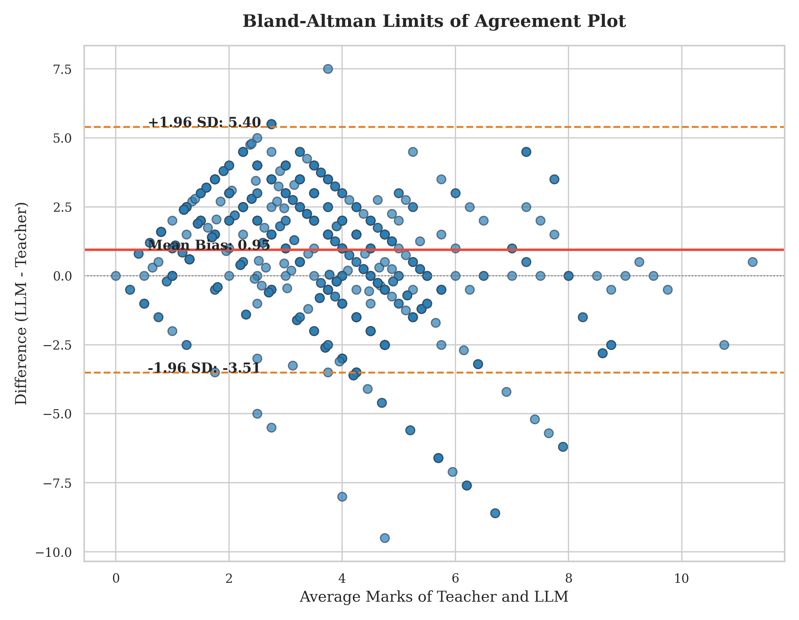

# AutoGrade — Intelligent Examination Evaluation & Verification System

An end-to-end AI-powered pipeline that automatically grades handwritten student answer sheets using OCR, semantic similarity, and LLM-based evaluation.

---

## Problem Statement

Manual evaluation of descriptive answer sheets is:
- **Time-consuming** — hours spent per batch of papers
- **Inconsistent** — grading varies across evaluators
- **Difficult to scale** — impractical for large class sizes

AutoGrade automates this entire workflow using modern NLP and Generative AI.

---

## Architecture

```
Scanned Answer Sheet (Image / PDF)
              │
              ▼
      ┌───────────────┐
      │  Pixtral OCR  │  ← Vision model extracts handwritten text
      └───────┬───────┘
              │
              ▼
      ┌───────────────┐
      │   Question    │  ← Regex + LLM hybrid segmentation
      │   Splitter    │
      └───────┬───────┘
              │
       ┌──────┴──────┐
       ▼              ▼
  ┌──────────┐  ┌────────────┐
  │BERTScore │  │   SBERT    │  ← Dual semantic similarity scoring
  │(token)   │  │(sentence)  │
  └────┬─────┘  └─────┬──────┘
       │               │
       └───────┬───────┘
               ▼
      ┌────────────────┐
      │  Mistral LLM   │  ← Expert grading with structured feedback
      │    Grader       │
      └───────┬────────┘
              │
              ▼
      ┌───────────────┐
      │   Scorecard   │  ← Marks + feedback per question
      │    Report     │
      └───────────────┘
```

---

## Features

- **Handwritten OCR** — Pixtral Large vision model transcribes handwritten answers
- **Automatic Answer Key Extraction** — scan an answer key image to produce structured JSON
- **Dual Semantic Scoring** — BERTScore (token-level) + SBERT cosine similarity (sentence-level)
- **LLM-Based Grading** — Mistral Large assigns marks with constructive feedback
- **PDF Pipeline** — Converts multi-page PDFs → enhanced images → OCR → grading
- **Pluggable OCR Engines** — Pixtral (cloud), PaddleOCR, EasyOCR (offline)
- **Hybrid Question Extraction** — Regex with intelligent LLM fallback parser
- **OCR Caching** — MD5-based caching to avoid redundant API calls
- **Checkpointing & Resume** — progress saved every 20 answers; survives interruptions
- **Rate Limit Handling** — exponential backoff for API throttling
- **Benchmarking Suite** — evaluates 4,274 answers against teacher marks with correlation analysis
- **Analytics & Visualization** — scatter plots, KDE distributions, box plots, pie charts

---

## Project Structure

```
AutoGrade/
├── README.md                          # This file
├── requirements.txt                   # Combined Python dependencies
├── LICENSE                            # MIT License
│
├── docs/
│   └── project_brief.md              # Detailed project documentation
│
├── final_pipeline/                    # Core grading engine
│   ├── ocr_pixtral.py                # Pixtral OCR — image to text
│   ├── create_answer_key.py          # Answer key image → structured JSON
│   ├── evaluator.py                  # BERTScore + SBERT + LLM grading
│   ├── pipeline.py                   # Main orchestrator (caching, segmentation, scorecards)
│   ├── test_dataset.py               # Large-scale benchmarking (4,274 answers)
│   ├── answer_key.json               # Sample answer key
│   ├── input_papers/                  # Place scanned answer sheets here
│   ├── datasets/                      # Benchmarking datasets (CSV)
│   ├── output/                        # Generated scorecards & plots
│   ├── results_backup/                # Evaluation checkpoints
│   └── logs/                          # Runtime logs
│
└── handwritten_pipeline/              # PDF preprocessing extension
    ├── README.md                      # Detailed setup & usage guide
    ├── run_pipeline.py                # Entry point
    ├── prepare_student_pdfs.py        # Extract PDFs from LMS export
    ├── configs/
    │   └── pipeline_config.yaml       # All pipeline parameters
    ├── src/
    │   ├── pdf_processor.py           # PDF → enhanced images
    │   ├── ocr_engine.py              # Pluggable OCR (Pixtral/PaddleOCR/EasyOCR)
    │   ├── question_extractor.py      # Hybrid regex + LLM question segmentation
    │   ├── grading_adapter.py         # Bridge to final_pipeline evaluator
    │   ├── batch_runner.py            # Batch processing with checkpointing
    │   └── evaluation.py              # Metrics & report generation
    ├── tests/                         # Unit tests
    ├── student_pdfs/                  # Place student PDF files here
    └── output_handwritten/            # Generated results
```

---

## Tech Stack

| Component | Technology |
|---|---|
| **Language** | Python |
| **OCR** | Pixtral Large (Mistral Vision Model) |
| **LLM Grader** | Mistral Large |
| **Embeddings** | Sentence Transformers (all-MiniLM-L6-v2) |
| **Semantic Scoring** | BERTScore, SBERT Cosine Similarity |
| **Data Processing** | Pandas, NumPy |
| **Visualization** | Matplotlib, Seaborn |
| **Statistics** | SciPy, Scikit-learn |
| **PDF Processing** | pdf2image, Pillow |
| **API Client** | OpenAI SDK (Mistral-compatible) |


## Grading Methodology

Each student answer is evaluated using a **3-pronged approach**:

1. **BERTScore** — Token-level precision, recall, and F1 against the reference answer
2. **SBERT Similarity** — Sentence-level cosine similarity using `all-MiniLM-L6-v2` embeddings
3. **Mistral Large LLM** — Expert-level grading with structured JSON output containing:
   - Numeric grade (0 to max marks, supports decimals)
   - Constructive written feedback

The LLM uses `temperature=0.2` for consistent, reproducible grading.

---

## Results & Visualizations

Benchmark evaluation across **4,274 answers** comparing AutoGrade's AI-assigned scores against teacher-assigned marks.

### Question-wise Average Score Comparison


### Student Total Score Comparison


### Grading Correlation Scatter Plot


### Grading Error Distribution


### Question-wise Mean Absolute Error


### Question Deviation Percentage


### Bland-Altman Agreement Analysis


---

